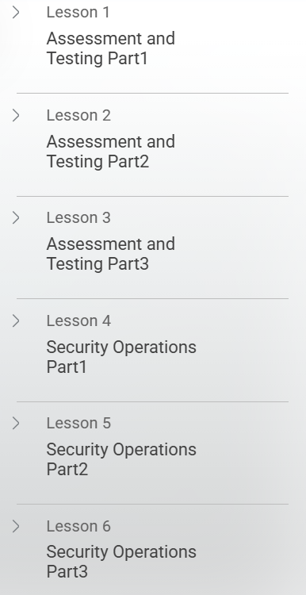
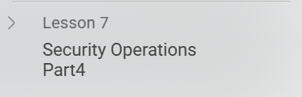

# 🛡️ Introduction to CISSP Security Assessment & Testing & Security Operations

This repository contains **notes, labs, cheatsheets, scenarios, case studies, and a certificate of completion** for the  
*Introduction to CISSP Security Assessment & Testing and Security Operations* course.  
The program covers **security assessment, penetration testing, SOC operations, incident response, and business continuity** concepts.

---

## 📚 Notes
- 📄 [01-introduction.md](./notes/01-introduction.md) – Course Introduction  
- 📄 [02-security-assessment.md](./notes/02-security-assessment.md) – Security Assessment Fundamentals  
- 📄 [03-penetration-testing.md](./notes/03-penetration-testing.md) – Penetration Testing Concepts  
- 📄 [04-security-operations.md](./notes/04-security-operations.md) – Security Operations Overview  
- 📄 [05-incident-response.md](./notes/05-incident-response.md) – Incident Response Lifecycle  
- 📄 [06-business-continuity.md](./notes/06-business-continuity.md) – BCP & DRP Concepts  
- 📄 [07-review.md](./notes/07-review.md) – Summary & Key Takeaways  

---

## 🧪 Labs
- 🔧 [vulnerability-scan-lab.md](./labs/vulnerability-scan-lab.md) – Vulnerability Scanning Practice  
- 🔧 [penetration-test-lab.md](./labs/penetration-test-lab.md) – Penetration Testing Simulation  
- 🔧 [soc-monitoring-lab.md](./labs/soc-monitoring-lab.md) – SOC Monitoring Exercises  
- 🔧 [incident-response-lab.md](./labs/incident-response-lab.md) – Incident Response Simulation  
- 🔧 [bcp-drp-scenario.md](./labs/bcp-drp-scenario.md) – BCP & DRP Activation Lab  

---

## 📋 Cheatsheets
- 📘 [assessment-methods.md](./cheatsheets/assessment-methods.md) – Security Assessment Quick Reference  
- 📘 [incident-response-lifecycle.md](./cheatsheets/incident-response-lifecycle.md) – IR Lifecycle Cheatsheet  
- 📘 [pentest-phases.md](./cheatsheets/pentest-phases.md) – Penetration Testing Phases  
- 📘 [soc-monitoring-cheatsheet.md](./cheatsheets/soc-monitoring-cheatsheet.md) – SOC Monitoring Reference  
- 📘 [bcp-drp-metrics.md](./cheatsheets/bcp-drp-metrics.md) – BCP/DRP Metrics Overview  

---

## 📝 Scenarios
- 📝 [incident-response-scenario.md](./scenarios/incident-response-scenario.md) – IR Scenario  
- 📝 [penetration-test-scenario.md](./scenarios/penetration-test-scenario.md) – Pen Test Scenario  
- 📝 [soc-operations-scenario.md](./scenarios/soc-operations-scenario.md) – SOC Operations Scenario  
- 📝 [bcp-drp-scenario.md](./scenarios/bcp-drp-scenario.md) – BCP/DRP Scenario  

---

## 🔬 Extras
- 📑 [case-studies.md](./extras/case-studies.md) – Real-world Case Studies  
- 📑 [resources.md](./extras/resources.md) – References & Learning Resources  
- 📆 [timeline.md](./extras/timeline.md) – Timeline of Security Practices  

---

## 📖 Docs
- 📘 [index.md](./docs/index.md) – Program Overview  
- 📘 [glossary.md](./docs/glossary.md) – Security Terms Glossary  
- 📘 [references.md](./docs/references.md) – External References  
- 📘 [roadmap.md](./docs/roadmap.md) – Learning Roadmap  
- 📘 [syllabus.md](./docs/syllabus.md) – Course Syllabus  

---

## 📸 Screenshots

| Step | Screenshot |
|------|------------|
| 🎬 Lesson 1 |  |
| 🎬 Lesson 2 |  |

---

## 📜 Certificate
🎓 [Certificate – CISSP Security Assessment & Testing and Security Operations](./cert/Introduction%20to%20CISSP%20Security%20Assessment%20%26%20Testing%20and%20Security%20Operations%20Certificate.pdf)

---

## 📝 Personal Review
This course provides a **solid foundation in security assessment, penetration testing, SOC operations, incident response, and business continuity**.  
The combination of **notes, labs, cheatsheets, and scenario-based exercises** helped me strengthen both **theoretical knowledge** and **practical skills** for real-world security operations.

---

## ✍️ Author
**Thành Danh** – Red Team Learner & Security Researcher  

- GitHub: [@ngvuthdanhh](https://github.com/ngvuthdanhh)  
- Email: ngvu.thdanh@gmail.com  

---

## 📄 License
This project is licensed under the **MIT License**. See [LICENSE](./LICENSE) for full details.  
© 2025 ngvuthdanhh. All rights reserved.
